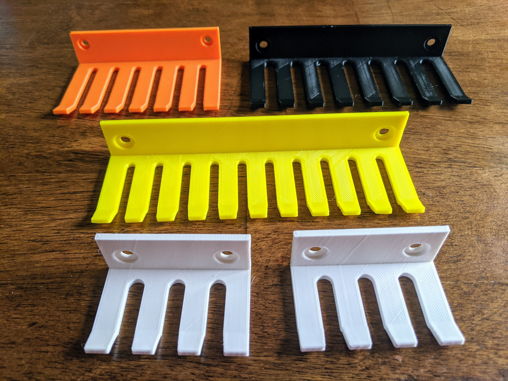
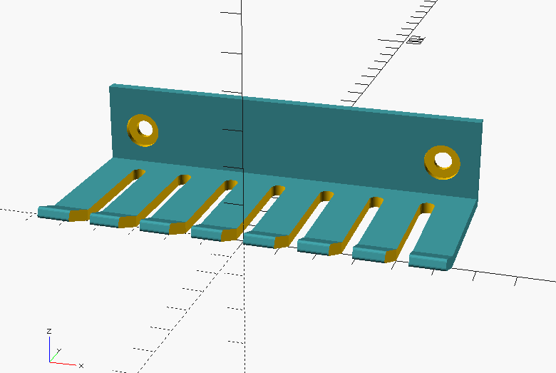
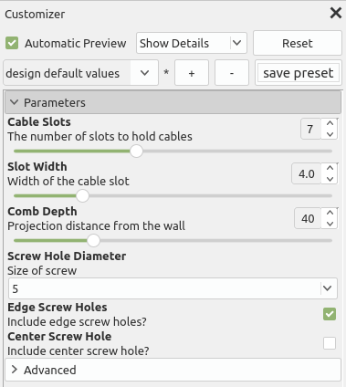
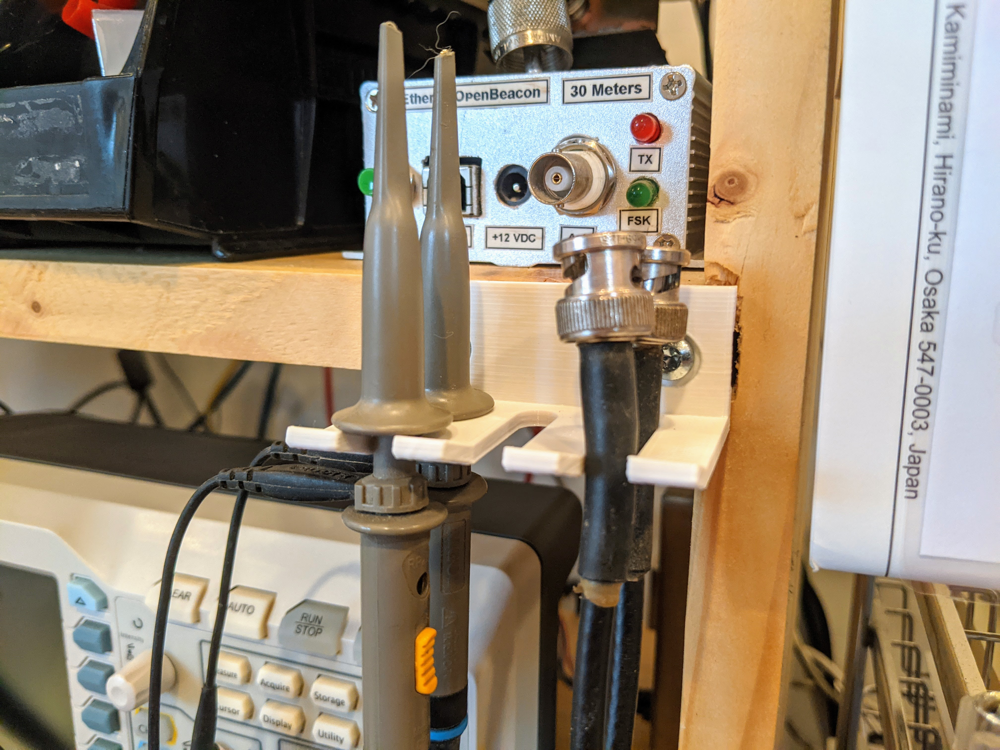

# Parametric Cable Comb

3D print your own cable organizer, customized to your needs. Simply open the .scad file in OpenSCAD, and then use the Customizer panel in order to make a cable comb to your specifications. Once it's the way you want, export to STL and print as normal.

## Thanks For Your Support!

If you would like to support my development efforts, I would ask that you please consider sending a [one-time PayPal tip](https://paypal.me/NT7S) or [subscribe to me on SubscribeStar](https://www.subscribestar.com/nt7s) for an ongoing contribution. Thank you!

## Parameters

All of the measurements are in millimeters. I've tried to set sane limits in the Customizer, but if you need to exceed them, you can do so by editing the .scad file directly. Let me know if you run into problems or have suggestions for improvements.

There are some advanced parameters available that you shouldn't normally need to touch, but are exposed in case you have some special circumstances.

## Printing

This model is not very difficult to print. The most important thing is to align the model so that the comb tines are laying on the build surface, in order to give the comb the most strength against breaking. Use supports (for the slightly-angled lip) and an infill of about 50%.

